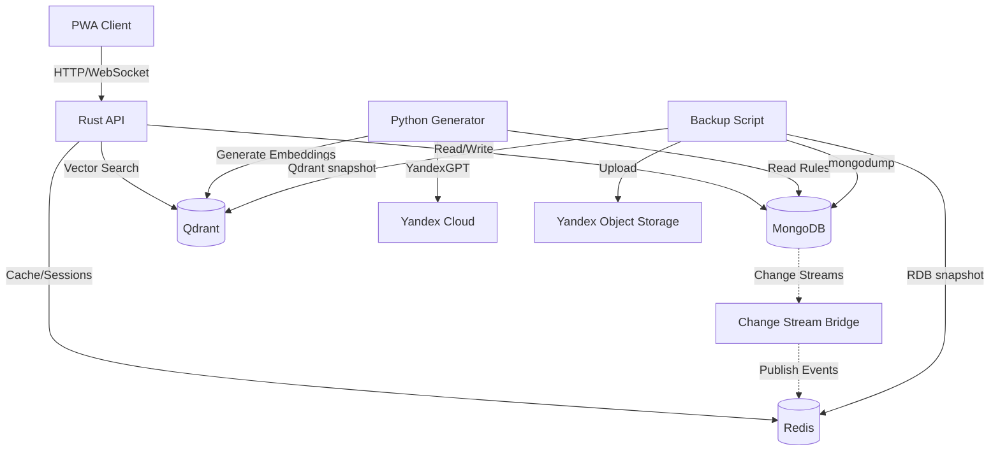
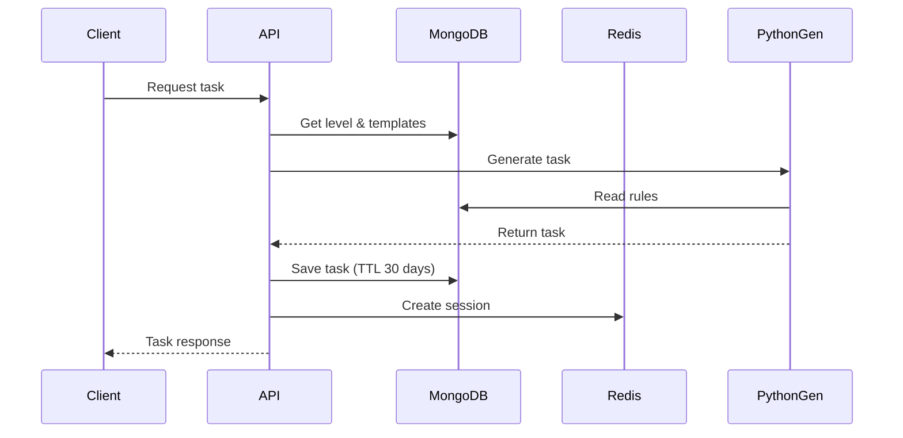
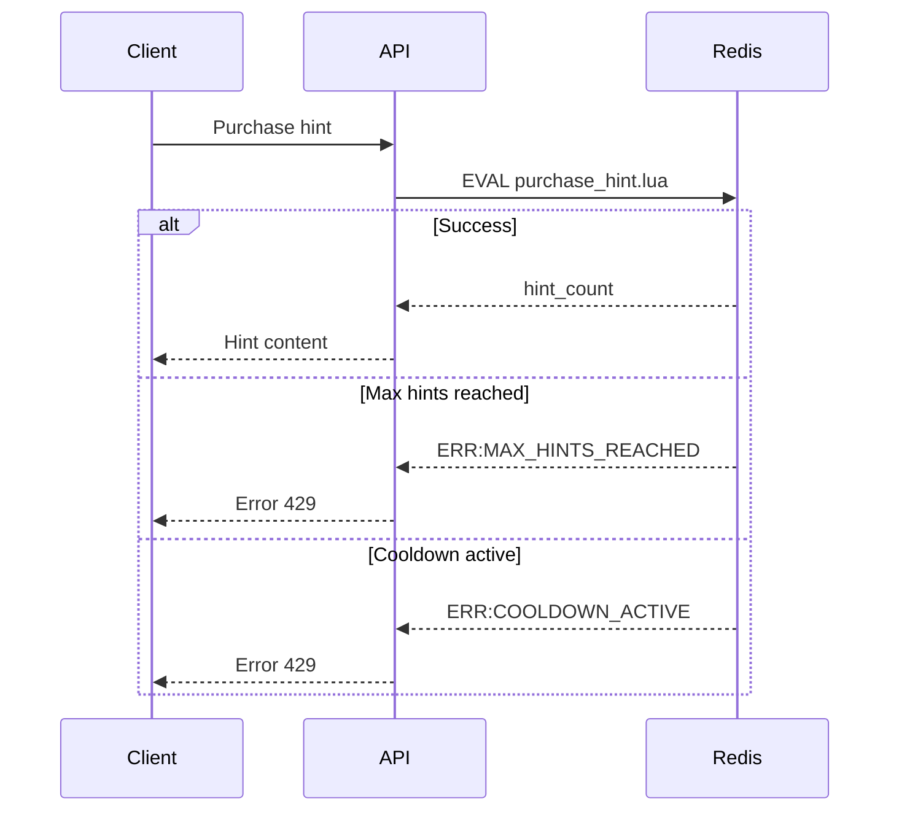
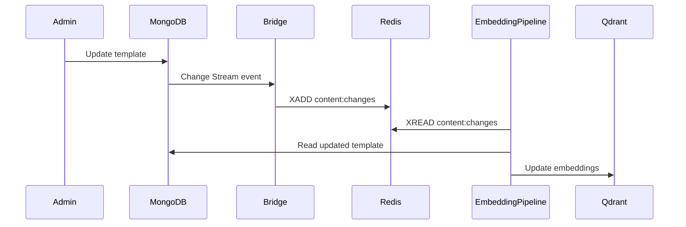

# TrainingGround Data Model

## Обзор

TrainingGround использует полиглот-персистентность для оптимальной работы с различными типами данных:

- **MongoDB** — основное хранилище (пользователи, задания, прогресс)
- **Redis** — кеш, сессии, античит, очереди
- **Qdrant** — векторный поиск для правил и примеров

## Архитектура данных



## MongoDB Collections

### Core Collections

#### users
```typescript
{
  _id: ObjectId,
  email: string,              // unique
  name: string,
  role: 'student' | 'teacher' | 'admin',
  sso_provider: 'yandex' | 'vk' | 'gosuslugi' | null,
  sso_id: string | null,      // unique per provider
  groups: ObjectId[],         // references to groups
  preferences: object,
  createdAt: Date,
  updatedAt: Date
}

Indexes:
- email (unique)
- {sso_provider, sso_id} (unique, sparse)
- role
- groups
```

#### groups
```typescript
{
  _id: ObjectId,
  name: string,
  teacher_id: ObjectId,       // reference to users
  student_ids: ObjectId[],    // references to users
  settings: object,
  createdAt: Date
}

Indexes:
- teacher_id
- student_ids
```

#### topics
```typescript
{
  _id: ObjectId,
  slug: string,               // unique (e.g., "morphology")
  name: string,               // display name
  description: string,
  order: number               // display order
}

Indexes:
- slug (unique)
- order
```

#### levels
```typescript
{
  _id: ObjectId,
  topic_id: ObjectId,         // reference to topics
  order: number,
  name: string,
  unlock_condition: {
    required_accuracy?: number,
    required_level_id?: ObjectId
  }
}

Indexes:
- {topic_id, order} (unique)
- topic_id
```

### Content Collections

#### templates
```typescript
{
  _id: ObjectId,
  level_id: ObjectId,         // reference to levels
  rule_ids: ObjectId[],       // references to rules
  params: object,             // generation parameters
  version: number,
  active: boolean,
  createdAt: Date
}

Indexes:
- {level_id, active}
- rule_ids
- version
- createdAt
```

#### rules
```typescript
{
  _id: ObjectId,
  slug: string,               // unique (e.g., "noun-case-genitive")
  name: string,
  description: string,
  examples: Array<{
    correct: string,
    incorrect?: string,
    explanation: string
  }>,
  metadata: object
}

Indexes:
- slug (unique)
```

### Runtime Collections

#### tasks (TTL: 30 days)
```typescript
{
  _id: ObjectId,
  template_id: ObjectId,      // reference to templates
  session_id: string,         // session identifier
  content: {
    sentence: string,
    blanks: number[],
    options?: string[]
  },
  correct_answer: string,
  hints: Array<{
    text: string,
    cost: number
  }>,
  createdAt: Date             // TTL index
}

Indexes:
- session_id
- template_id
- createdAt (TTL: 30 days)
```

#### attempts
```typescript
{
  _id: ObjectId,
  session_id: string,
  task_id: ObjectId,          // reference to tasks
  user_answer: string,
  is_correct: boolean,
  hints_used: number,
  time_spent_ms: number,
  timestamp: Date
}

Indexes:
- {session_id, timestamp DESC}
- task_id
- {session_id, task_id, timestamp DESC}
- timestamp DESC
```

### Analytics Collections

#### progress_summary
```typescript
{
  _id: ObjectId,
  user_id: ObjectId,          // reference to users
  level_id: ObjectId,         // reference to levels
  correct_count: number,
  total_count: number,
  accuracy: number,           // 0-100
  avg_time_ms: number,
  updatedAt: Date
}

Indexes:
- {user_id, level_id} (unique)
- {user_id, updatedAt DESC}
- {level_id, accuracy DESC}
```

#### materialized_stats
```typescript
{
  _id: ObjectId,
  type: 'group' | 'level' | 'topic',
  entity_id: ObjectId,
  metrics: {
    total_users?: number,
    avg_accuracy?: number,
    total_attempts?: number
  },
  calculatedAt: Date
}

Indexes:
- {type, entity_id} (unique)
- calculatedAt DESC
```

#### leaderboards (TTL: 24 hours)
```typescript
{
  _id: ObjectId,
  scope: 'global' | 'group' | 'level',
  scope_id: ObjectId | null,
  rankings: Array<{
    user_id: ObjectId,
    score: number,
    rank: number,
    name: string
  }>,
  generatedAt: Date           // TTL index
}

Indexes:
- {scope, scope_id} (unique, sparse)
- generatedAt (TTL: 24 hours)
```

### Security Collections

#### incidents
```typescript
{
  _id: ObjectId,
  user_id: ObjectId,          // reference to users
  session_id: string,
  type: 'tab_switch' | 'rapid_submit' | 'pattern_abuse' | 'impossible_time',
  severity: 'low' | 'medium' | 'high' | 'critical',
  details: object,
  timestamp: Date
}

Indexes:
- {user_id, timestamp DESC}
- session_id
- {type, severity}
- {user_id, type, timestamp DESC}
- timestamp DESC
```

#### feature_flags
```typescript
{
  _id: ObjectId,
  flag_name: string,          // unique
  enabled: boolean,
  rollout_percentage: number, // 0-100
  target_groups: string[],    // group IDs or slugs
  updatedAt: Date
}

Indexes:
- flag_name (unique)
- enabled
```

### Logging Collections

#### hints_log
```typescript
{
  _id: ObjectId,
  session_id: string,
  task_id: ObjectId,          // reference to tasks
  hint_index: number,         // 0, 1, 2, ...
  timestamp: Date
}

Indexes:
- {session_id, task_id}
- timestamp DESC
```

## Redis Keyspace

### Session Management
```
session:{session_id}                    # Hash, TTL: 60 min
  - user_id, level_id, task_id, hints_used, started_at

session:timer:{session_id}              # String, TTL: 60 min
  - timestamp (milliseconds)
```

### Hints
```
hints_used:{session_id}                 # String (counter), TTL: 60 min
hint:cooldown:{user_id}:{task_id}       # String, TTL: 5 sec
```

### Anticheat
```
anticheat:{user_id}                     # Hash, TTL: 24 hours
  - tab_switches, rapid_submits, last_submit_time

anticheat:block:{user_id}               # String, TTL: 15 min - 24 hours
```

### Scoring
```
score:series:{user_id}                  # List (max 100), TTL: 24 hours
score:streak:{user_id}                  # String (counter), TTL: 24 hours
```

### Feature Flags Cache
```
feature_flag_cache                      # Hash, TTL: 5 min
feature_flag:{flag_name}                # String, TTL: 5 min
```

### Content Changes Stream
```
content:changes                         # Stream (maxlen 1000)
  - {collection, document_id, action, version, timestamp, idempotency_key}
```

### Explanation Cache
```
explanation:cache:{task_id}             # String (JSON), TTL: 1 hour
explanation:pending:{task_id}           # String, TTL: 30 sec
```

## Qdrant Collections

### rules_embeddings
```
Vector dimension: 768
Distance: Cosine
HNSW config: M=16, ef_construction=200

Payload schema:
- rule_id: keyword
- slug: keyword
- difficulty: keyword
- text: string
```

### examples_embeddings
```
Vector dimension: 768
Distance: Cosine
HNSW config: M=16, ef_construction=200

Payload schema:
- rule_id: keyword
- type: keyword (correct/incorrect)
- text: string
```

### templates_embeddings
```
Vector dimension: 768
Distance: Cosine
HNSW config: M=16, ef_construction=200

Payload schema:
- template_id: keyword
- level_id: keyword
- active: bool
- text: string
```

## Data Flows

### Task Generation Flow


### Hint Purchase Flow


### Content Change Stream Flow


## Backup Strategy

### Schedule
- **MongoDB**: WAL backup каждый час
- **Redis**: RDB snapshot каждые 15 минут
- **Qdrant**: Full snapshot ежедневно

### Retention
- **Daily**: 30 дней
- **Weekly**: 12 недель
- **Monthly**: 12 месяцев

### Storage
- **Location**: Yandex Object Storage (S3-compatible)
- **Encryption**: AES-256
- **Restore SLA**: ≤15 минут

## Performance Considerations

### MongoDB
- Read preference: `primaryPreferred` для аналитики
- Write concern: `w: majority` для критичных операций
- Change Streams требуют replica set

### Redis
- Persistence: Hybrid RDB + AOF
- Eviction policy: `allkeys-lru`
- Maxmemory: 2GB (dev), 8GB (prod)

### Qdrant
- HNSW параметры оптимизированы для recall ≥0.95
- Snapshot время: ~5 минут для 1M векторов
- Query latency: <50ms (p95)

## Security

### PII Protection
- MongoDB Field Level Encryption для email, имен
- Redis password-protected
- Qdrant API key required

### Audit Trail
- Все изменения templates/rules логируются
- Incidents collection для античит событий
- Backup logs в S3 metadata
