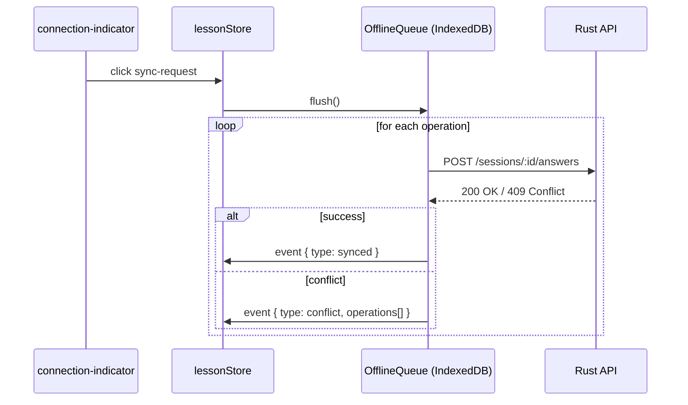

# Offline sync flow

PWA хранит все карточки, ответы и подсказки локально, чтобы тренажёр продолжал работать при обрыве сети. Этот документ описывает архитектуру синхронизации, соглашения по API и меры против конфликтов.

## Архитектура

- **IndexedDB** — очередь операций (`src/lib/offline-queue.ts`). Каждая запись содержит `type` (`answer` или `hint`), `sessionId`, `payload`, время создания и счётчик попыток.
- **Workbox + Service Worker** — кеширует shell и API, чтобы приложение загружалось офлайн. Service Worker рассылает события `sw-update-available` и `sw-offline-ready`.
- **LessonStore** (`src/lib/session-store.ts`) — основной orchestrator. Слушает события `online/offline`, управляет очередью, запускает повторную отправку и создаёт уведомления.
- **UI компоненты** — `connection-indicator` и `conflict-resolver` показывают состояние/очередь/конфликты и позволяют пользователю вручную решить коллизии.

## Жизненный цикл операции

1. Пользователь отправляет ответ или просит подсказку.
2. Если `navigator.onLine === false` и фича-флаг `offlineQueue` включен, операция сериализуется и кладётся в IndexedDB со статусом `queued`. Пользователь видит уведомление «добавлено в очередь».
3. Переход в онлайн или нажатие кнопки «Синхронизировать» вызывает `lessonStore.flushOfflineQueue()`.
4. Для каждой операции выбранный handler делает HTTP‑запрос. Успешные удаляются (`synced`), ошибки получают `attempts++` и остаются до следующей попытки.
5. Ответы с кодами 409/410 считаются конфликтами: операция удаляется, а payload попадает в `lessonStore.state.conflicts`.

Ниже представлена последовательность перезапуска очереди:

## Обработка конфликтов

- Каждая конфликтная операция отображается в `conflict-resolver`. Пользователь может принять серверную версию (`accept-server`), повторить отправку локальной (`keep-local`) или удалить запись (`dismiss`).
- После решения конфликта `lessonStore.resolveConflict` обновляет state, отправляет уведомление и, при необходимости, повторно ставит операцию в очередь.
- Если конфликтов больше нет, `connection-indicator` обновляет счётчик и уведомление возвращается в «зелёное» состояние.

## Edge cases

- **Истёкшая сессия** — API возвращает ошибку, операция помечается как конфликт (409) и пользователь решает, нужен ли повтор.
- **Множественные конфликты** — события дедуплицируются по `operation.id`, чтобы UI не показывал дублей.
- **Переполненная очередь** — размер очереди отображается в UI; при росте количества элементов пользователь получает предупреждение о необходимости синхронизации.
- **Background Sync** — даже если приложение закрыто, Workbox может возобновить отправку, как только браузер разрешит выполнение.

## Диагностика

- `npm run dev` + DevTools > Application > IndexedDB — просмотр содержимого очереди.
- `npm run test:e2e -- --grep offline` — гарантирует, что офлайн‑путь и повторная синхронизация работают.
- `npm run test:a11y` — проверяет, что пустой/конфликтный состояния UI доступны с клавиатуры и скринридера.
